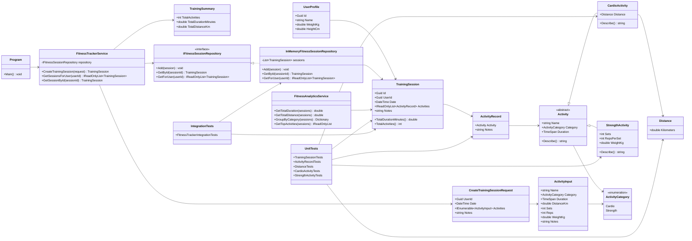

```mermaid
classDiagram
    direction LR

    class Program {
        +Main() void
    }

    class FitnessTrackerService {
        -IFitnessSessionRepository repository
        +CreateTrainingSession(request) TrainingSession
        +GetSessionsForUser(userId) IReadOnlyList~TrainingSession~
        +GetSessionById(sessionId) TrainingSession
    }

    class CreateTrainingSessionRequest {
        +Guid UserId
        +DateTime Date
        +IEnumerable~ActivityInput~ Activities
        +string Notes
    }

    class ActivityInput {
        +string Name
        +ActivityCategory Category
        +TimeSpan Duration
        +double DistanceKm
        +int Sets
        +int Reps
        +double WeightKg
        +string Notes
    }

    class TrainingSummary {
        +int TotalActivities
        +double TotalDurationMinutes
        +double TotalDistanceKm
    }

    class UserProfile {
        +Guid Id
        +string Name
        +double WeightKg
        +double HeightCm
    }

    class TrainingSession {
        +Guid Id
        +Guid UserId
        +DateTime Date
        +IReadOnlyList~ActivityRecord~ Activities
        +string Notes
        +TotalDurationMinutes() double
        +TotalActivities() int
    }

    class ActivityRecord {
        +Activity Activity
        +string Notes
    }

    class Activity {
        <<abstract>>
        +string Name
        +ActivityCategory Category
        +TimeSpan Duration
        +Describe() string
    }

    class CardioActivity {
        +Distance Distance
        +Describe() string
    }

    class StrengthActivity {
        +int Sets
        +int RepsPerSet
        +double WeightKg
        +Describe() string
    }

    class Distance {
        +double Kilometers
    }

    class ActivityCategory {
        <<enumeration>>
        Cardio
        Strength
    }

    class IFitnessSessionRepository {
        <<interface>>
        +Add(session) void
        +GetById(sessionId) TrainingSession
        +GetForUser(userId) IReadOnlyList~TrainingSession~
    }

    class InMemoryFitnessSessionRepository {
        -List~TrainingSession~ sessions
        +Add(session) void
        +GetById(sessionId) TrainingSession
        +GetForUser(userId) IReadOnlyList~TrainingSession~
    }

    class FitnessAnalyticsService {
        +GetTotalDuration(sessions) double
        +GetTotalDistance(sessions) double
        +GroupByCategory(sessions) Dictionary
        +GetTopActivities(sessions) IReadOnlyList
    }

    class UnitTests {
        +TrainingSessionTests
        +ActivityRecordTests
        +DistanceTests
        +CardioActivityTests
        +StrengthActivityTests
    }

    class IntegrationTests {
        +FitnessTrackerIntegrationTests
    }

    Program --> FitnessTrackerService

    FitnessTrackerService --> IFitnessSessionRepository
    FitnessTrackerService --> CreateTrainingSessionRequest
    FitnessTrackerService --> TrainingSummary

    CreateTrainingSessionRequest --> ActivityInput

    UserProfile --> TrainingSession
    TrainingSession --> ActivityRecord
    ActivityRecord --> Activity

    Activity <|-- CardioActivity
    Activity <|-- StrengthActivity

    CardioActivity --> Distance
    Activity --> ActivityCategory
    ActivityInput --> ActivityCategory

    IFitnessSessionRepository <|.. InMemoryFitnessSessionRepository
    InMemoryFitnessSessionRepository --> TrainingSession

    FitnessAnalyticsService --> TrainingSession

    UnitTests --> TrainingSession
    UnitTests --> ActivityRecord
    UnitTests --> Distance
    UnitTests --> CardioActivity
    UnitTests --> StrengthActivity

    IntegrationTests --> InMemoryFitnessSessionRepository
    IntegrationTests --> TrainingSession
```