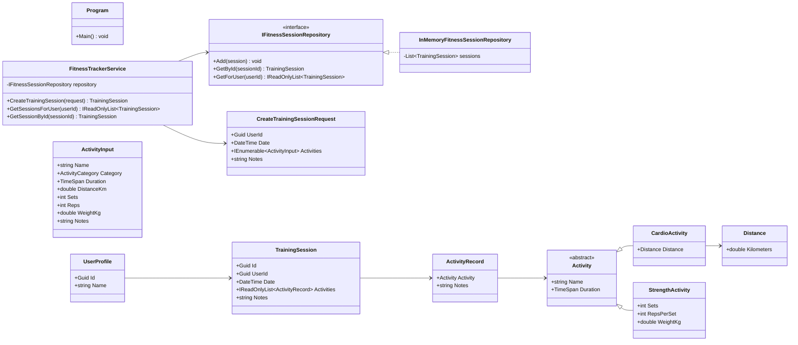

# FitnessTracker UML Diagram

```mermaid
classDiagram
    direction LR

    class Program {
        +Main() void
    }

    class FitnessTrackerService {
        -IFitnessSessionRepository repository
        +CreateTrainingSession(request) TrainingSession
        +GetSessionsForUser(userId) IReadOnlyList~TrainingSession~
        +GetSessionById(sessionId) TrainingSession
    }

    class CreateTrainingSessionRequest {
        +Guid UserId
        +DateTime Date
        +IEnumerable~ActivityInput~ Activities
        +string Notes
    }

    class ActivityInput {
        +string Name
        +ActivityCategory Category
        +TimeSpan Duration
        +double DistanceKm
        +int Sets
        +int Reps
        +double WeightKg
        +string Notes
    }

    class TrainingSession {
        +Guid Id
        +Guid UserId
        +DateTime Date
        +IReadOnlyList~ActivityRecord~ Activities
        +string Notes
    }

    class ActivityRecord {
        +Activity Activity
        +string Notes
    }

    class Activity {
        <<abstract>>
        +string Name
        +TimeSpan Duration
    }

    class CardioActivity {
        +Distance Distance
    }

    class StrengthActivity {
        +int Sets
        +int RepsPerSet
        +double WeightKg
    }

    class Distance {
        +double Kilometers
    }

    class UserProfile {
        +Guid Id
        +string Name
    }

    class IFitnessSessionRepository {
        <<interface>>
        +Add(session) void
        +GetById(sessionId) TrainingSession
        +GetForUser(userId) IReadOnlyList~TrainingSession~
    }

    class InMemoryFitnessSessionRepository {
        -List~TrainingSession~ sessions
    }

    Activity <|-- CardioActivity
    Activity <|-- StrengthActivity

    ActivityRecord --> Activity
    TrainingSession --> ActivityRecord
    CardioActivity --> Distance

    IFitnessSessionRepository <|.. InMemoryFitnessSessionRepository

    FitnessTrackerService --> IFitnessSessionRepository
    FitnessTrackerService --> CreateTrainingSessionRequest
    UserProfile --> TrainingSession
```