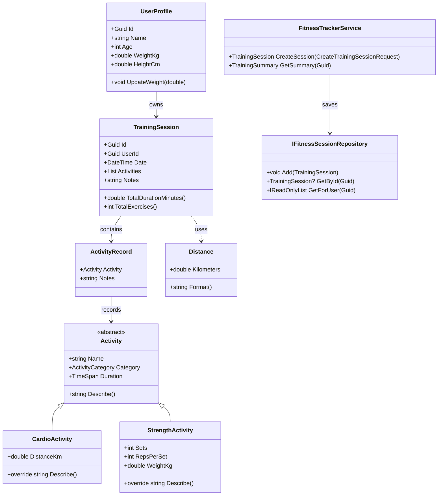

# FitnessTracker Class Diagram

```mermaid
classDiagram
    class UserProfile {
        +Guid Id
        +string Name
        +int Age
        +double WeightKg
        +double HeightCm
        +void UpdateWeight(double)
    }

    class TrainingSession {
        +Guid Id
        +Guid UserId
        +DateTime Date
        +List<ActivityRecord> Activities
        +string Notes
        +double TotalDurationMinutes()
        +int TotalExercises()
    }

    class ActivityRecord {
        +Activity Activity
        +string Notes
    }

    class Activity {
        <<abstract>>
        +string Name
        +ActivityCategory Category
        +TimeSpan Duration
        +string Describe()
    }

    class CardioActivity {
        +double DistanceKm
        +override string Describe()
    }

    class StrengthActivity {
        +int Sets
        +int RepsPerSet
        +double WeightKg
        +override string Describe()
    }

    class Distance {
        +double Kilometers
        +string Format()
    }

    class IFitnessSessionRepository {
        +void Add(TrainingSession)
        +TrainingSession? GetById(Guid)
        +IReadOnlyList<TrainingSession> GetForUser(Guid)
    }

    class FitnessTrackerService {
        +TrainingSession CreateSession(CreateTrainingSessionRequest)
        +TrainingSummary GetSummary(Guid)
    }

    UserProfile --> TrainingSession : owns
    TrainingSession --> ActivityRecord : contains
    ActivityRecord --> Activity : records
    Activity <|-- CardioActivity
    Activity <|-- StrengthActivity
    TrainingSession ..> Distance : uses
    FitnessTrackerService --> IFitnessSessionRepository : saves
```
