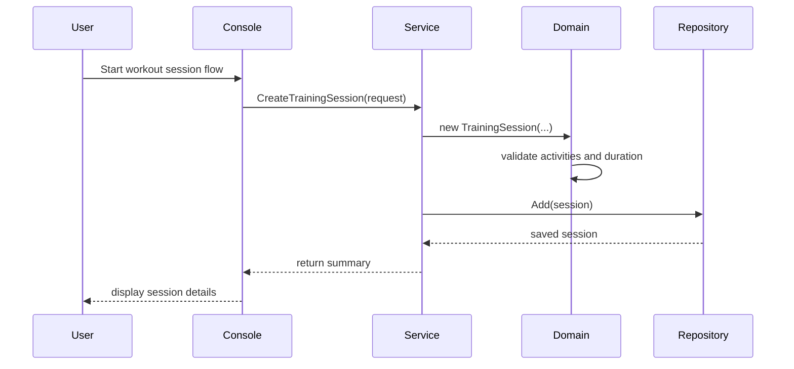

# FitnessTracker Sequence Diagram

```mermaid
sequenceDiagram
    participant User
    participant Console
    participant Service
    participant Domain
    participant Repository

    User->>Console: Start workout session flow
    Console->>Service: CreateTrainingSession(request)
    Service->>Domain: new TrainingSession(...)
    Domain->>Domain: validate activities and duration
    Service->>Repository: Add(session)
    Repository-->>Service: saved session
    Service-->>Console: return summary
    Console-->>User: display session details
```
